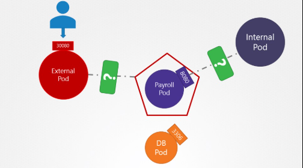
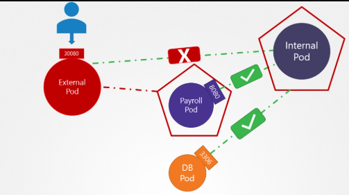

# Network Policies

Two things define you: your patience when you have nothing and your attitude when you have everything.

– George Bernard Shaw

1. How many network policies do you see in the environment?

We have deployed few web applications, services and network policies. Inspect the environment.

Run the command: 

```bash
kubectl get networkpolicy 

#or

kubectl get netpol

NAME             POD-SELECTOR   AGE
payroll-policy   name=payroll   4m10s
```

2. What is the name of the Network Policy?

**payroll-policy**

3. Which pod is the Network Policy applied on?

**payroll**

4. What type of traffic is this Network Policy configured to handle?

Run the command: 

```bash
kubectl describe networkpolicy
```

and look under the Policy Types section.

5. What type of traffic is this Network Policy configured to handle?

**Ingress**

Run the command: ``` kubectl describe networkpolicy ``` and look under the Policy Types section.

```bash
k describe netpol payroll-policy

Name:         payroll-policy
Namespace:    default
Created on:   2025-08-27 20:08:31 +0000 UTC
Labels:       <none>
Annotations:  <none>
Spec:
  PodSelector:     name=payroll
  Allowing ingress traffic:
    To Port: 8080/TCP
    From:
      PodSelector: name=internal
  Not affecting egress traffic
  Policy Types: Ingress
```

6. What is the impact of the rule configured on this Network Policy?

**internal pod can access port 8080 on payroll pod**

7. Access the UI of these applications using the link given above the terminal.

8. Perform a connectivity test using the User Interface in these Applications to access the payroll-service at port 8080.

The hostname for the external service is its Kubernetes Service name: **payroll-service**

Access it using **payroll-service** as host and **8080** as port from the Internal Application's UI



Only internal application can access payroll service

9. Perform a connectivity test using the User Interface of the Internal Application to access the external-service at port 8080.

The hostname for the external service is its Kubernetes Service name: external-service
Access it using external-service as host and 8080 as port from the Internal Application's UI

10. Create a network policy to allow egress traffic from the Internal application only to the payroll-service and db-service.

Use the spec given below. You might want to enable ingress traffic to the pod to test your rules in the UI.

Also, ensure that you allow egress traffic to DNS ports TCP and UDP (port 53) to enable DNS resolution from the internal pod.

Solution manifest file for a network policy internal-policy as follows:

```bash
apiVersion: networking.k8s.io/v1
kind: NetworkPolicy
metadata:
  name: internal-policy
  namespace: default
spec:
  podSelector:
    matchLabels:
      name: internal
  policyTypes:
  - Egress
  - Ingress
  ingress:
    - {}
  egress:
  - to:
    - podSelector:
        matchLabels:
          name: mysql
    ports:
    - protocol: TCP
      port: 3306

  - to:
    - podSelector:
        matchLabels:
          name: payroll
    ports:
    - protocol: TCP
      port: 8080

  - ports:
    - port: 53
      protocol: UDP
    - port: 53
      protocol: TCP
```

**Explanation:**

Target Pods:
This policy applies to all pods in the default namespace with the label name: internal.

**Ingress:**
All incoming traffic is allowed to these pods. This is typically needed for UI-based testing during labs.

In production, you should restrict ingress to only trusted sources.

**Egress:**
Outbound traffic is restricted to:

- Pods labeled name: mysql on TCP port 3306 (database service)
- Pods labeled name: payroll on TCP port 8080 (payroll service)
- Any destination on UDP/TCP port 53 (for DNS resolution, required for service discovery in Kubernetes)
- DNS Access:
DNS is handled by the kube-dns service, which listens on port 53 for both UDP and TCP:

```bash
root@controlplane:~> kubectl get svc -n kube-system 
NAME       TYPE        CLUSTER-IP   EXTERNAL-IP   PORT(S)                  AGE
kube-dns   ClusterIP   10.96.0.10   <none>        53/UDP,53/TCP,9153/TCP   18m
```

- Policy Name: internal-policy

- Policy Type: Egress

- Egress Allow: payroll

- Payroll Port: 8080

- Egress Allow: mysql

- MySQL Port: 3306




