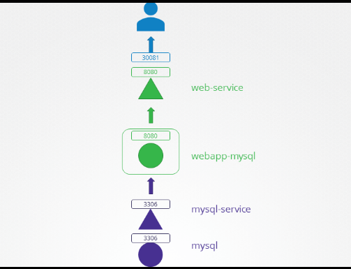
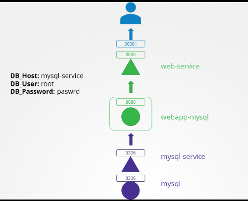

# Application failure

Question everything. Learn something. Answer nothing.

– Euripides

Excellence happens not by accident. It is a process.

– Dr. APJ. Abdul Kalam

**Troubleshooting Test 1:** A simple 2 tier application is deployed in the alpha namespace. It must display a green web page on success. Click on the App tab at the top of your terminal to view your application. It is currently failed. Troubleshoot and fix the issue.


Stick to the given architecture. Use the same names and port numbers as given in the below architecture diagram. Feel free to edit, delete or recreate objects as necessary.




**Hint**
Check the object names and make sure they match the ones given in the architecture diagram.

**Solution**
The service name used for the MySQL Pod is incorrect. According to the Architecture diagram, it should be mysql-service.

To fix this, first delete the current service: kubectl -n alpha delete svc mysql

Then create a new service with the following YAML file (or use imperative command):

```yaml
# mysql-service.yaml
apiVersion: v1
kind: Service
metadata:
  name: mysql-service
  namespace: alpha
spec:
    ports:
    - port: 3306
      targetPort: 3306
    selector:
      name: mysql
```

Create the new service: ``` kubectl create -f mysql-service.yaml ```

**Troubleshooting Test 2:** The same 2 tier application is deployed in the beta namespace. It must display a green web page on success. Click on the App tab at the top of your terminal to view your application. It is currently failed. Troubleshoot and fix the issue.


Stick to the given architecture. Use the same names and port numbers as given in the below architecture diagram. Feel free to edit, delete or recreate objects as necessary.

**Hint**
In the beta namespace, check the ports configured on the services.


```bash
k -n beta get all
NAME                                READY   STATUS    RESTARTS   AGE
pod/mysql                           1/1     Running   0          92s
pod/webapp-mysql-5c4c675768-dh25q   1/1     Running   0          92s

NAME                    TYPE        CLUSTER-IP      EXTERNAL-IP   PORT(S)          AGE
service/mysql-service   ClusterIP   10.43.131.234   <none>        3306/TCP         92s
service/web-service     NodePort    10.43.78.146    <none>        8080:30081/TCP   92s

NAME                           READY   UP-TO-DATE   AVAILABLE   AGE
deployment.apps/webapp-mysql   1/1     1            1           92s

NAME                                      DESIRED   CURRENT   READY   AGE
replicaset.apps/webapp-mysql-5c4c675768   1         1         1       92s
```

If you inspect the mysql-service in the beta namespace, you will notice that the targetPort used to create this service is incorrect.

Compare this to the Architecture diagram and change it to 3306. Update the mysql-service as per the below YAML:

```yaml
# mysql-service-2.yaml
apiVersion: v1
kind: Service
metadata:
  name: mysql-service
  namespace: beta
spec:
    ports:
    - port: 3306
      targetPort: 3306
    selector:
      name: mysql
```

```bash
 k apply -f mysql-service-2.yaml
```

**Troubleshooting Test 3:** The same 2 tier application is deployed in the gamma namespace. It must display a green web page on success. Click on the App tab at the top of your terminal to view your application. It is currently failed or unresponsive. Troubleshoot and fix the issue.


Stick to the given architecture. Use the same names and port numbers as given in the below architecture diagram. Feel free to edit, delete or recreate objects as necessary.

**Hint**
Inspect the selector used by the mysql-service. Is it correct?

If you inspect the mysql-service, you will see that that the selector used does not match the label on the mysql pod.

- Service:

```bash
root@controlplane:~# kubectl -n gamma describe svc mysql-service | grep -i selector
Selector:          name=sql00001
```

- Pod:

```bash
root@controlplane:~# kubectl -n gamma describe pod mysql | grep -i label   
Labels:       name=mysql
```

As you can see the selector used is **name=sql001** whereas it should be **name=mysql**.
Update the **mysql-service** to use the correct selector as per the below YAML:

```yaml
---
apiVersion: v1
kind: Service
metadata:
  name: mysql-service
  namespace: gamma
spec:
    ports:
    - port: 3306
      targetPort: 3306
    selector:
      name: mysql
```

```bash
k -n gamma apply -f mysql-service-3.yaml
```

**Troubleshooting Test 4:** The same 2 tier application is deployed in the delta namespace. It must display a green web page on success. Click on the App tab at the top of your terminal to view your application. It is currently failed. Troubleshoot and fix the issue.


Stick to the given architecture. Use the same names and port numbers as given in the below architecture diagram. Feel free to edit, delete or recreate objects as necessary.

**Hint**
Are the environment variables used by the deployment correct?

**Solution**
Try accessing the web application from the browser using the tab called app. You will notice that it cannot connect to the MySQL database:


Environment Variables: DB_Host=mysql-service; DB_Database=Not Set; DB_User=sql-user; DB_Password=paswrd; 1045 (28000): Access denied for user 'sql-user'@'10.244.1.9' (using password: YES)

According to the architecture diagram, the **DB_User** should be root but it is set to **sql-user** in the **webapp-mysql** deployment.

Use the command kubectl -n delta edit deployments.apps webapp-mysql and update the environment variable as follows:

```bash
k -n delta get deploy webapp-mysql -o yaml > webapp-mysql.yaml
```

```yaml
spec:
      containers:
      - env:
        - name: DB_Host
          value: mysql-service
        - name: DB_User
          value: root
        - name: DB_Password
          value: paswrd
```

```bash
k -n delta apply -f webapp-mysql.yaml
```

**Troubleshooting Test 5:** The same 2 tier application is deployed in the epsilon namespace. It must display a green web page on success. Click on the App tab at the top of your terminal to view your application. It is currently failed. Troubleshoot and fix the issue.


Stick to the given architecture. Use the same names and port numbers as given in the below architecture diagram. Feel free to edit, delete or recreate objects as necessary.



**Hint**
Ensure the right password is configured for the database on the MySQL pod and the Web application.

**Solution**
If you inspect the environment variable called MYSQL_ROOT_PASSWORD, you will notice that the value is incorrect as compared to the architecture diagram: -

```bash
root@controlplane:~# kubectl -n epsilon describe pod mysql  | grep MYSQL_ROOT_PASSWORD 
      MYSQL_ROOT_PASSWORD:  passwooooorrddd
root@controlplane:~#
```

Correct this by deleting and recreating the mysql pod with the correct environment variable as follows: -

```yaml
spec:
  containers:
  - env:
    - name: MYSQL_ROOT_PASSWORD
      value: paswrd
```

Also edit the **webapp-mysql** deployment and make sure that the DB_User environment variable is set to root as follows: -

```yaml
spec:
    containers:
    - env:
      - name: DB_Host
        value: mysql-service
      - name: DB_User
        value: root
      - name: DB_Password
        value: paswrd
```

Once the objects are recreated, and you should be able to access the application.


**Troubleshooting Test 6:** The same 2 tier application is deployed in the zeta namespace. It must display a green web page on success. Click on the App tab at the top of your terminal to view your application. It is currently failed. Troubleshoot and fix the issue.


Stick to the given architecture. Use the same names and port numbers as given in the below architecture diagram. Feel free to edit, delete or recreate objects as necessary.

**Hint**
Inspect the ports used by the web-service is it correct? Are the environment variable used as per the architecture diagram?

**Solution**

There are a few things wrong in this setup:

1. If you inspect the web-service, you will see that the nodePort used is incorrect.
This service should be exposed on port 30081 and NOT 30088.

```bash
root@controlplane:~# kubectl -n zeta get svc web-service 
NAME          TYPE       CLUSTER-IP       EXTERNAL-IP   PORT(S)          AGE
web-service   NodePort   10.102.190.212   <none>        8080:30088/TCP   3m1s
root@controlplane:~#
```

To correct this, delete the service and recreate it using the below YAML file:

```yaml
---
apiVersion: v1
kind: Service
metadata:
  name: web-service
  namespace: zeta
spec:
  ports:
  - nodePort: 30081
    port: 8080
    targetPort: 8080
  selector:
    name: webapp-mysql
  type: NodePort
```

2. Also edit the webapp-mysql deployment and make sure that the DB_User environment variable is set to root as follows: -

```yaml
spec:
    containers:
    - env:
      - name: DB_Host
        value: mysql-service
      - name: DB_User
        value: root
      - name: DB_Password
        value: paswrd
```

3. The DB_Password used by the mysql pod is incorrect. Delete the current pod and recreate with the correct environment variable as per the snippet below: -

```yaml
spec:
  containers:
  - env:
    - name: MYSQL_ROOT_PASSWORD
      value: paswrd
```

4. Complete YAML should be as below: -

```yaml
apiVersion: apps/v1
kind: Deployment
metadata:
  labels:
    name: webapp-mysql
  name: webapp-mysql
  namespace: zeta
spec:
  selector:
    matchLabels:
      name: webapp-mysql
  template:
    metadata:
      labels:
        name: webapp-mysql
      name: webapp-mysql
    spec:
      containers:
        - env:
            - name: DB_Host
              value: mysql-service
            - name: DB_User
              value: root
            - name: MYSQL_ROOT_PASSWORD
              value: paswrd
          image: mmumshad/simple-webapp-mysql
          name: webapp-mysql
          ports:
            - containerPort: 8080
```

Once the objects are recreated, and you should be able to access the application.


