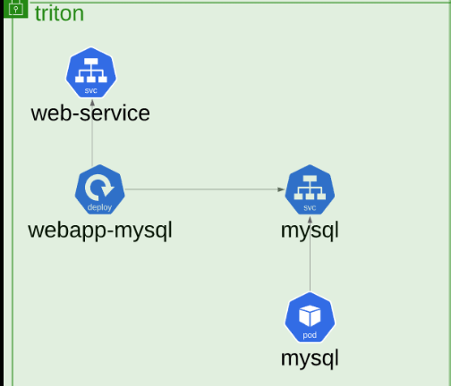

 # Troubleshoot Network

 The way to get started is to quit talking and begin doing.

– Walt Disney

**Troubleshooting Test 1:** A simple 2 tier application is deployed in the triton namespace. It must display a green web page on success. Click on the app tab at the top of your terminal to view your application. It is currently failed. Troubleshoot and fix the issue.


Stick to the given architecture. Use the same names and port numbers as given in the below architecture diagram. Feel free to edit, delete or recreate objects as necessary.



Do the services in triton namespace have a valid endpoint? If they do, check the kube-proxy and the weave logs.
Does the cluster have a Network Addon installed?


Install Weave using the link: https://kubernetes.io/docs/setup/production-environment/tools/kubeadm/create-cluster-kubeadm/#pod-network


For example:  ```curl -L https://github.com/weaveworks/weave/releases/download/latest_release/weave-daemonset-k8s-1.11.yaml | kubectl apply -f - ```


**Solution**

Start by checking the pods in the namespace triton , they are stuck in ContainerCreating state.

```bash
root@controlplane ~ ➜  k get pods -n triton
NAME                            READY   STATUS              RESTARTS   AGE
mysql                           0/1     ContainerCreating   0          2m10s
webapp-mysql-7bd5857746-qhrrq   0/1     ContainerCreating   0          2m10s
```

Check the pod details for more information:

```bash
root@controlplane ~ ➜  kubectl describe pod/mysql -n triton
Name:             mysql
Namespace:        triton
.
.
.

Events:
  Type     Reason                  Age                     From               Message
  ----     ------                  ----                    ----               -------
  Normal   Scheduled               5m34s                   default-scheduler  Successfully assigned triton/mysql to controlplane
  Warning  FailedCreatePodSandBox  5m34s                   kubelet            Failed to create pod sandbox: rpc error: code = Unknown desc = failed to setup network for sandbox "dd800900e6eb528af5afd679c1dfa02a7cbbcb9645014df37bac8e50270274c6": plugin type="weave-net" name="weave" failed (add): unable to allocate IP address: Post "http://127.0.0.1:6784/ip/dd800900e6eb528af5afd679c1dfa02a7cbbcb9645014df37bac8e50270274c6": dial tcp 127.0.0.1:6784: connect: connection refused
  Warning  FailedCreatePodSandBox  5m33s                   kubelet            Failed to create pod sandbox: rpc error: code = Unknown desc = failed to setup network for sandbox "fac1a8529953fca9a2c351091b882ea433df03ed421ec3efe5f9e5173c918dcf": plugin type="weave-net" name="weave" failed (add): unable to allocate IP address: Post "http://127.0.0.1:6784/ip/fac1a8529953fca9a2c351091b882ea433df03ed421ec3efe5f9e5173c918dcf": dial tcp 127.0.0.1:6784: connect: connection refused
  Warning  FailedCreatePodSandBox  5m32s                   kubelet            Failed to create pod sandbox: rpc error: code = Unknown desc = failed to setup network for sandbox "30890b3fd51a9fb788472228357a56f81c43b3c9fc20d4f9b2081d57fb65fff5": plugin type="weave-net" name="weave" failed (add): unable to allocate IP address: Post "http://127.0.0.1:6784/ip/30890b3fd51a9fb788472228357a56f81c43b3c9fc20d4f9b2081d57fb65fff5": dial tcp 127.0.0.1:6784: connect: connection refused
```

You will find that , The pod mysql in namespace triton initially failed multiple times to start due to Weave Net CNI plugin failures:
``` Failed to setup network for sandbox: plugin type="weave-net" ... dial tcp 127.0.0.1:6784: connect: connection refused ```

This indicates issue with Weave Net CNI , So , Check it's Pods:

```bash
root@controlplane ~ ➜  kubectl get pods -A
NAMESPACE     NAME                                   READY   STATUS              RESTARTS   AGE
kube-system   coredns-668d6bf9bc-2nwwf               1/1     Running             0          2m59s
kube-system   coredns-668d6bf9bc-lhzgz               1/1     Running             0          2m59s
kube-system   etcd-controlplane                      1/1     Running             0          3m7s
kube-system   kube-apiserver-controlplane            1/1     Running             0          3m7s
kube-system   kube-controller-manager-controlplane   1/1     Running             0          3m7s
kube-system   kube-proxy-hspkg                       1/1     Running             0          2m59s
kube-system   kube-scheduler-controlplane            1/1     Running             0          3m7s
triton        mysql                                  0/1     ContainerCreating   0          107s
triton        webapp-mysql-7bd5857746-vpg4n          0/1     ContainerCreating   0          106s
```

There are no any Weave Pods , which indicates it's not installed.

Install the Weave Net CNI using ``` curl -L https://github.com/weaveworks/weave/releases/download/latest_release/weave-daemonset-k8s-1.11.yaml | kubectl apply -f - ``` command.

```bash
root@controlplane ~ ➜  curl -L https://github.com/weaveworks/weave/releases/download/latest_release/weave-daemonset-k8s-1.11.yaml | kubectl apply -f -
  % Total    % Received % Xferd  Average Speed   Time    Time     Time  Current
                                 Dload  Upload   Total   Spent    Left  Speed
  0     0    0     0    0     0      0      0 --:--:-- --:--:-- --:--:--     0
100  6183  100  6183    0     0  14378      0 --:--:-- --:--:-- --:--:-- 14378
serviceaccount/weave-net created
clusterrole.rbac.authorization.k8s.io/weave-net created
clusterrolebinding.rbac.authorization.k8s.io/weave-net created
role.rbac.authorization.k8s.io/weave-net created
rolebinding.rbac.authorization.k8s.io/weave-net created
daemonset.apps/weave-net created
```

Check the pods again , they will be in running state:

```bash
root@controlplane ~ ➜  k get pods -n triton
NAME                            READY   STATUS    RESTARTS   AGE
mysql                           1/1     Running   0          4m11s
webapp-mysql-7bd5857746-qhrrq   1/1     Running   0          4m11s
```

**Troubleshooting Test 2:** The same 2 tier application is having issues again. It must display a green web page on success. Click on the app tab at the top of your terminal to view your application. It is currently failed. Troubleshoot and fix the issue.


Stick to the given architecture. Use the same names and port numbers as given in the below architecture diagram. Feel free to edit, delete or recreate objects as necessary.

**Troubleshooting Test 2:** The same 2 tier application is having issues again. It must display a green web page on success. Click on the app tab at the top of your terminal to view your application. It is currently failed. Troubleshoot and fix the issue.


Stick to the given architecture. Use the same names and port numbers as given in the below architecture diagram. Feel free to edit, delete or recreate objects as necessary.


**Hint**

There seems to be an issue with the Service Proxy. Inspect and Fix the **kube-proxy** daemonset.
Check logs of the kube-proxy pod.
It appears that the daemonset is using a wrong configuration file.Compare the configuration file used in the daemonset with the configmap for kube-proxy.
Edit the kube-proxy daemonset to correct the configuration file using kubectl -n kube-system edit ds kube-proxy.

**Solution**

Check the pods in all namespaces using ``` k get pods -A ``` command.
You will find the app Pods are running , however the **kube-proxy** is having issues.

```bash
root@controlplane ~ ➜  k get pods -A
NAMESPACE     NAME                                   READY   STATUS             RESTARTS      AGE
kube-system   coredns-668d6bf9bc-4nbdj               1/1     Running            0             3m45s
kube-system   coredns-668d6bf9bc-zcddz               1/1     Running            0             3m45s
kube-system   etcd-controlplane                      1/1     Running            0             3m50s
kube-system   kube-apiserver-controlplane            1/1     Running            0             3m52s
kube-system   kube-controller-manager-controlplane   1/1     Running            0             3m50s
kube-system   kube-proxy-wx5f9                       0/1     CrashLoopBackOff   2 (18s ago)   38s
kube-system   kube-scheduler-controlplane            1/1     Running            0             3m50s
kube-system   weave-net-5bgqz                        2/2     Running            0             117s
triton        mysql                                  1/1     Running            0             38s
triton        webapp-mysql-7bd5857746-wwfhz          1/1     Running            0             38s
```

Get the logs using k logs -n kube-system <POD_NAME> command .

```bash
kubectl -n kube-system logs kube-proxy-2t4fl 
E0912 09:37:52.046244       1 run.go:74] "command failed" err="failed complete: open /var/lib/kube-proxy/configuration.conf: no such file or directory"
```

This means kube-proxy is failing because it cannot find its configuration file at /var/lib/kube-proxy/configuration.conf.

Describe the failed pod using command k describe -n kube-system pod <POD_NAME>

```bash
root@controlplane ~ ➜  k describe -n kube-system pod kube-proxy-wx5f9
Name:                 kube-proxy-wx5f9
Namespace:            kube-system
...
    Mounts:
      /lib/modules from lib-modules (ro)
      /run/xtables.lock from xtables-lock (rw)
      /var/lib/kube-proxy from kube-proxy (rw)
      /var/run/secrets/kubernetes.io/serviceaccount from kube-api-access-gcxd6 (ro)
...
Volumes:
  kube-proxy:
    Type:      ConfigMap (a volume populated by a ConfigMap)
    Name:      kube-proxy
    Optional:  false
...

```
This confirms that **kube-proxy** expects its configuration to be mounted as a ConfigMap named **kube-proxy** into the ```/var/lib/kube-proxy ``` directory.

Check the ConfigMap using command : ``` kubectl get configmap -n kube-system kube-proxy -o yaml ```

```bash
root@controlplane /var/lib/kube-proxy ➜  kubectl get configmap -n kube-system kube-proxy -o yaml
apiVersion: v1
data:
  config.conf: |-
    apiVersion: kubeproxy.config.k8s.io/v1alpha1
    bindAddress: 0.0.0.0
    bindAddressHardFail: false
    clientConnection:
      acceptContentTypes: ""
      burst: 0
      contentType: ""
      kubeconfig: /var/lib/kube-proxy/kubeconfig.conf
...

```

Check the Current configs of the Deamonset :

```bash
oot@controlplane /var/lib/kube-proxy ➜  kubectl -n kube-system describe ds kube-proxy
Name:           kube-proxy
Selector:       k8s-app=kube-proxy
...
  Containers:
   kube-proxy:
    Image:      registry.k8s.io/kube-proxy:v1.26.0
    Port:       <none>
    Host Port:  <none>
    Command:
      /usr/local/bin/kube-proxy
      --config=/var/lib/kube-proxy/configuration.conf
      --hostname-override=$(NODE_NAME)
    Environment:
      NODE_NAME:   (v1:spec.nodeName)
    Mounts:
      /lib/modules from lib-modules (ro)
      /run/xtables.lock from xtables-lock (rw)
      /var/lib/kube-proxy from kube-proxy (rw)
  Volumes:
   kube-proxy:
    Type:      ConfigMap (a volume populated by a ConfigMap)
    Name:      kube-proxy
    Optional:  false
...

```
Based on the logs (failed complete: open ``` /var/lib/kube-proxy/configuration.conf ```: no such file or directory), the DaemonSet's --config argument points to configuration.conf, but the ConfigMap provides its main configuration under **config.conf**

Fix
We need to change the **kube-proxy** DaemonSet to point to the correct configuration file name that exists in the kube-proxy ConfigMap , which is : **config.conf**

Edit the DaemonSet:

```bash
kubectl -n kube-system edit ds kube-proxy

# OR

kubectl -n kube-system get ds kube-proxy -o yaml > kube-proxy.yaml

```

Find the command or args section.

```yaml
command:
        - /usr/local/bin/kube-proxy
        - --config=/var/lib/kube-proxy/configuration.conf # <--- THIS IS THE LINE TO CHANGE
        - --hostname-override=$(NODE_NAME)
```

Change configuration.conf to config.conf

```yaml
command:
        - /usr/local/bin/kube-proxy
        - --config=/var/lib/kube-proxy/config.conf # <--- CHANGED!
        - --hostname-override=$(NODE_NAME)
```

```bash
kubectl -n kube-system delete ds kube-proxy
kubectl -n kube-system apply -f kube-proxy.yaml
```

Monitor kube-proxy pod status and verify application connectivity.

```bash
k get pods -n kube-system -w
```


